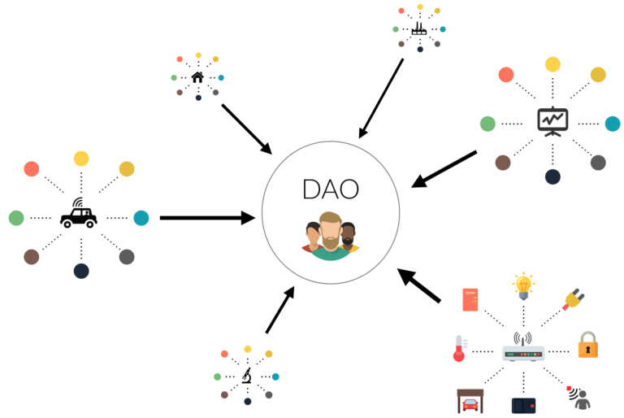
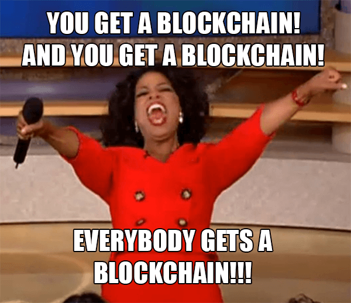
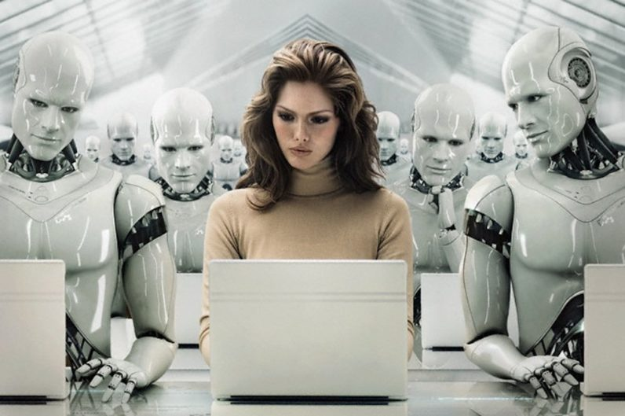
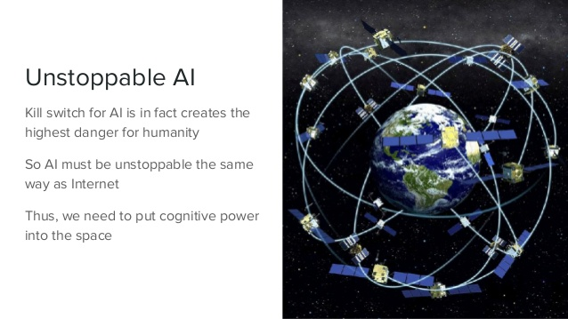
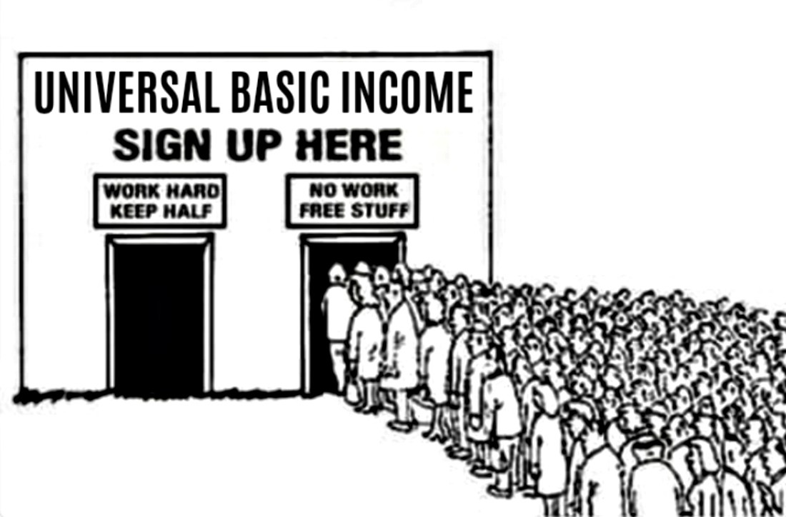

 See this [Medium article](https://medium.com/@trentmc0/nature-2-0-27bdf8238071). 

***Blockchain as a new life form?***

I have recently read a mind-blowing [article](https://medium.com/@trentmc0/nature-2-0-27bdf8238071) written by Trent McConaughy on Medium, which let me rethink about how we should frame the concept of "life" in the context of AI.

## **1 - Life as a "self-sustaining entity"**

Trent's "life" doesn't take into account of cognition, conscienceness and so on. For Trent, **"life" here simply refers to a** ***"self-sustaining entity"***. 

The "life" entity has 2 properties to fulfill:

1. ***Self-sustaining*** -- feed on its own, able to sustain oneself with some kind of "incentive". For animals that could be food, for us that could be money or etc.

2. ***Anti-fragile*** -- it could not be easily destroyed; instead, it gets stronger after being attacked. eg. Think of human, either as an entity or a community. Trent also gives an example on forests, when burnt by fire trees will grow higher and stronger.

How could this kind of "lifeform" be achieved in AI?

For that, we should include the concept of blockchain, framing it in the point of view of ***"decentralized autonomous organization" (DAO)***.

<!--  -->

##### (Duh, I first thought DAO refers to Data Access Object -- apparently it isn't.)

## **2 - Blockchain comes to help**

We know that the concept of blockchain backs the Bitcoin community. Personally, I conclude that the blockchain concept contributes these 2 main ideas to DAO:

1. ***Incentive machine*** -- the whole system incentivizes "an effort" by rewarding one with "an incentive". In the Bitcoin context the "effort" is security, as miners spend computational power to solve a hard cryptographic problem; whereas the "incentive", is Bitcoin.

2. ***Decentralization*** -- no single node can control the whole system, as the current state is a consensus reached by the majority of nodes in the network. Hence when the system is initiated, it can't be stopped practically, as there is no "on-off" button held on by someone.

It is precisely these 2 ideas that build the DAO --

- ***decentralized***, well, as stated above;

- ***autonomous***, because it is incentivized such that it will work voluntarily and automatically;

- and it comes with ***resource manipulation***, as it can own, trade or do whatever with its earned "incentives"!

Now we can understand Ralph Merkle's unfathomable quote, saying that blockchain is a new life form:

> …It lives and breathes on the internet. It lives because it can pay people to keep it alive. It lives because it performs a useful service that people will pay it to perform. It lives because anyone, anywhere, can run a copy of its code. It lives because all the running copies are constantly talking to each other. It lives because if any one copy is corrupted it is discarded, quickly and without any fuss or muss. It lives because it is radically transparent: anyone can see its code and see exactly what it does.

It is precisely that --

- DAO is *"self-sustaining"* due to its autonomy, backed by the concept of incentive machine;

- and it is *"anti-fragile"* due to decentralization, as it cannot be destroyed easily by an "on-off" button, and a single attack could have make the whole network stronger.

Trent claims that DAO is the new building block of "life form"!

## **3 - And AI comes in with DAO...**

When AI comes together with DAO, ***it simply makes the DAO perform better at its incentivized work.***

I particularly like the idea of Trent on ArtDAO: 

> The agent generates art **(work)** -> sells it on a marketplace **(community interaction)** -> earns token **(incentive)** -> generates art again -> ...

The cycle of "work, community interaction, incentive" is precisely how human operates today, and it is a sustainable way to operate!

So in some day, self-driving cars can work to fetch people to some places and earn by its own.

AI music composers can compose music, publishes it and earn royalties by its own.

Even Google Translate can do translation and earn money by its own!

In short, ***AI gives DAO greater capabilities, and DAO gives AI the form of life sustainability.***

It is ultimately unstoppable!

<!--  -->

## **4 - Making UBI possible - but is it?**

One possible speculation Trent made is to deposit all incentive AI DAO earn to the universal basic income (UBI) chain. In that way, AI seems to generate income for us "voluntarily", while we enjoy financial freedom on top of their effort.

But for me, that sounds paradoxical.

AI DAO agents are supposed to own themselves, being "as they are". Even if they earn incentives, the incentives **belongs to themselves**. And since they are decentralized, no one unit is able to control them, so how are we going to, in some way, "own" their incentive?

***We are designing AI DAO agents for them to be "as they are", but on the other hand we want to gain control of what they have earned.*** 

Aren't both views contradicting each other?

Let's delve deeper. Let's assume that it is possible to get AI DAO agents willingly generate UBI for us. Think of the world that we would see in this context --

1. Human resources will be ***highly dependent*** on AI. When we surrender our will to work to AI, our income depends highly on AI. When they perform well, everyone gets rich; but when they underperform, our purchasing power gets weaken. And since they are decentralized agents, I don't think we have a say on their performance.

2. Our value system is mainly depicted by the **amount of work done** -- we honour those who work hard and despise those who are lazy. But in this world, everyone gets paid and machines do the work. How would our value system adapt to this change? Who shall we honor in this case, when everyone is ***"lazier"***?

One may argue that humans can still work to earn more money on top of UBI. But in the world where machines could work for humans -- 

- working will be seen as something "unwise", "petty", "machine-like" and will definitely be discouraged. Such beliefs would make our economy depend even more on AI. 

- there may not even be vacancies for human to work if AI DAO agents are all around; or, if humans are to work, they will be competing with AI DAO agents who are in the position, and what makes us think that we would still be competitive enough at that point of time?

## **5 - A world more on "interest"**

However, I have a rather optimistic (or, utopian) view on this speculated world. I believe that our value system will shift towards ***the amount of interest being fulfilled*** -- we would honour those who are able to fulfill their own interest and passion to the maximum extent, as that will be the virtue in the world where AI could work for us.

Which is why I think in that world the art industry may blossom, because I believe that the very one field that human will always stay ahead of AI is the ability to ***interpret and appreciate art***. 

We may have art generators, but their work will not be as touching as Van Gogh. 

We may have AI music composers, but there will still be something which is "not there", compared to the masterpieces by Chopin or Alan Walker.

It is a sense of feel, which is unexplainable, that only humans can achieve on their own.

Every single one would try their best to attain a higher level of pleasure, by fulfilling their own interest and passion, when they have the chance to transfer their mundane life-earning job to someone else, forever. They cook, they play music, they draw, they garden...and they honour those who can live their live to the fullest.

Which is why I speculate that the art industry will greatly benefit from the wide spread of AI DAO agents and UBI, just like the Renaissance era in the old days.

## **5 - To sum up...**

Nature 2.0 - the name Trent gave for the entire concept, portraying an ecosystem built on silicon and steel.

I personally think that this idea is indeed revolutionary and mind-blowing. But I prefer using the term ***"autonomous agent"*** over ***"life"***. To me, life should be a far more complex entity filled with emotion and conscienceness, compared to a purpose-oriented autonomous agent. 

However, Trent's view does provide an insight on how we could elevate autonomous agents to the next level -- how they could be truly "autonomous" and "self-sustaining".

It sounds contradictory for me for these new "life forms" to create UBI for us. But foreseeing a world that humans transfer power to AI DAO agents, it is optimistic to think that humans could achieve financial freedom easier, assuming that UBI is willingly generated by agents. But bear in mind that we should not submit ourselves entirely to AI, such that our lives are totally dependent on their performance. We should instead switch our focues to something else - something **interesting** for us - as that will make us create our very own ever-winning ground.