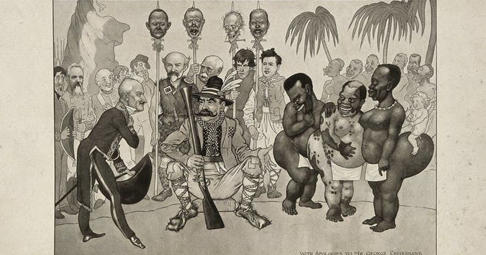
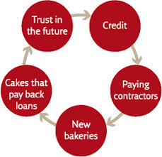
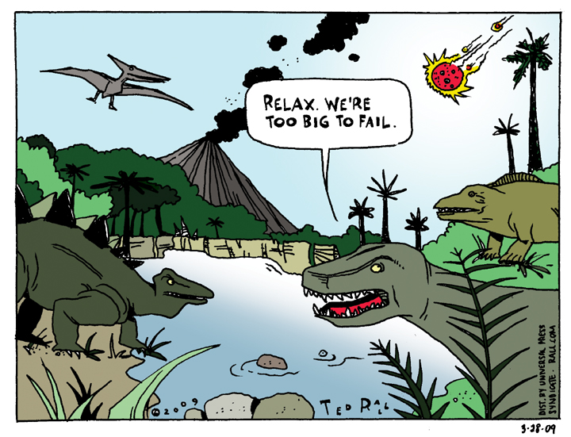
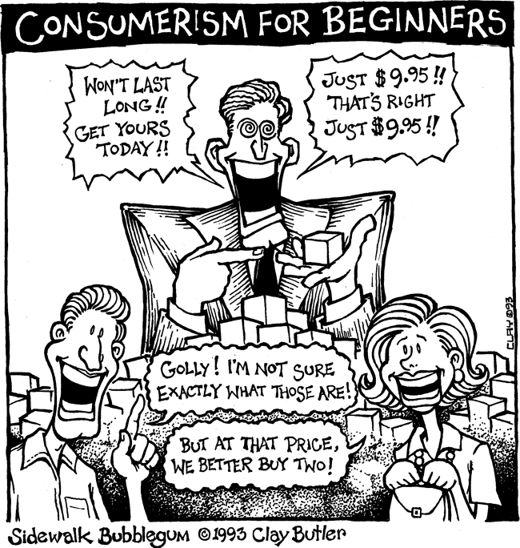

 See this [book review](https://books.google.com.my/books/about/Sapiens.html?id=FmyBAwAAQBAJ&source=kp_cover&redir_esc=y) to know more about Sapiens. 

In [the last part](sapiens-1.html) we talk about how we come over as human beings. In this part, we will focus on the next 5 keypoints on **what we are taught to believe in**.

## **6. Science backed by empire**

It will be too naive for us to conclude that the Scientific Revolution was initiated merely by the hunger of curiosity of several scientists. It turns out that **science drives a large part of itself through its marriage with the empire**.

The cure for scurvy didn't appear until a long expedition led by James Cook faced 2 million dying lives on the ship. Massive information were collected from Cook expedition and a lot of other British expedition, even including rare spider species and forgotten scripts, but of obvious political and military value. Even ARPANet - the ancestor of the internet, was created solely for military purposes at first.

**Science supplies the technology to serve our needs, and the empire creates massive demand to stimulate the supply.**The Chinese and the Indians did not lack the technological invention in the 20th century, even explosives were pioneered by the Chinese. But it seemed like both of them lost their war to British -- because for them, *building an empire was a scientific project, and setting up a scientific discipline was an imperial project*.

What's even "evil" is that **science became a tool for imperialist upon marriage**, when scientists produced proofs that Europeans are superior to all other races and are rightful to rule over them, forcing the subjects to believe and accept that as a fact. Some proved that the speakers of the primordial language of all Indo-European languages called themselves Aryans, and further claimed that Aryans are the purest race upon natural selection. 

Technology advancement today claims to serve the true needs of the people, but is it again a sugar-coated tale told by the imperialists? I personally believe that although science would still need to be backed by some kind of political willingness, ***the universality created by the Web*** and the ***lower barrier to access open-source technology today*** would be greater community that truly serves the needs of the people.

## **7. Capitalism - greed is good**

Let's say A earn 1M and deposit to the bank. So now the bank has 1M of real cash.

Then, B wants to start a coffee business, so B loans 1M from the bank. Now, the 1M cash lies in the bank, but B holds this **credit value** of 1M in his hand. Using this 1M credit value, B pays A to do some renovation and starts the coffee business. A deposits that 1M into the bank again.

Now A has 2M of money in his account. But the true amount of cash, is just 1M! ***The 1M that he received from B, is actually his own money being loaned out!***

And this can go on and on, creating a bubble, until reaching the limit stipulated by the nation's law. In nice words it is called a **credit system**, but in not-so-nice words you can called it a [Ponzi scheme](https://www.investopedia.com/terms/p/ponzischeme.asp) actually. But if you call this a Ponzi scheme, then sadly the entire economy system will be a massive, giant fraud.

We have devised a system that urges people to spend future money, hoping that it will drive the economy, and assuming that there will be a greater return that can cover the expenditure. ***Greed is good*** in this sense. But even the discussion up till now we can discuss on 2 problems:

- What if **we do not have greater return that covers what we spend?** One can choose to spend even more future money, but increasing the bet simply means increasing the risk. It is simply a gamble that even large financial institutions play today, and until some day when the amount of bet is so big that these institutions become ["too big to fail"](https://en.wikipedia.org/wiki/Too_big_to_fail), we could either sit to witness the dreadful tragedy of the bubble burst, or sit and watch the government use our money to cover their private losses.

- This simply shows that the capitalist system **cannot ensure that profits are gained in a fair way, or distributed in a fair manner**. The rich gets richer, we don't have a say on that, and even slave systems were created in the past. But even till today, it still seems hard for us to totally abandon this system that intoxicate us on our wildest greed and desire.

## **8. Consumerism - handling the excess**

Then, we have a "problem" of excess resources. How do we convince the people to **buy what they don't need**? That's where consumerism comes in.

It is actually a follow-up from capitalism. Since greed is good, you have a rightful reason to spend your money. You should treat yourself better and enjoy. And saving is cursed -- why should you save when you have that money to buy something that makes you feel better, although you don't really need it?

Who really needs a Hermes bag, an Armani suit, or a Lamborghini car? The answer is no one. But just look at the crowd chasing over branded stuffs and overpriced luxuries. Whenever you feel that you need them, you are officially a follower of the ***capitalist-consumerism*** religion, a religion so manipulative that followers do what they are asked to do, but also what they are voluntarily willing to do.

## **9. Individualism - state's and market's summon**

We used to live closely within a family or a community before the Industrial Revolution. One stays with his family members, works for the family business, take care of family members who are sick, and matchmakes his children with other families' children for marriage. Family functions for almost everything for an individual back in the old days.

But when the Industrial Revolution was able to give the market and the state new powers, including new means for communication and transportation, the tie within the family and the community seems to slowly collapse. The state tells you to **make your own choices** because you have the rights to decide your own lives, so don't follow orders and be rebellious to your control-freak parents. 

The market tells you that you can **get anything you need at ease to live on your own**. If you are sick, go to the pharmacy; if you need someone to take care of you, go to the hospital; if you want something, buy it from the grocery, or today you can even buy online; even if you need a soulmate, go to dating websites. The market is always your best friend.

Nationalism did came in during the 19th century to unite the citizens for war. It is a relation loose enough to allow individual freedom (away from the family), but tight enough to hold the nation together. But in this era which we have the luxury to enjoy peace, individualism often takes the lead thanks to the intervention of the state and market, which is why we observe weaker family bonds and neighbourhood spirits, but firmer self-centered opinions in today's world.

## **10. Happiness - which way to choose?**

All the ideas discussed above are to answer this ultimate question of *homo sapiens*: **what is the kind of happiness that we are looking for in life?**

To answer the question, we must first discuss what is happiness. This is not supposed to be philosophical, but one good framing goes like this: happiness is ***the correlation of objective conditions and subjective expectations***.

Reason is simple: a starving child in Africa may still feel happy, and a billionaire with a nice family and a houseful of fortune may still feel unhappy. It does not depend on either "what you have" or "what you want", it depends on both.

Which is why in the age of consumerism, one doesn't easily feel satisfied. It is the job of advertisement agencies to raise your expectations for living, to show you that there is a way to live a "better quality of life", ranging from promoting you with water purifiers, air cleaners, automated dish washing machine and so much more. They are obliged to **contrast the difference between "what you have" and "what you want"**, and once you become unhappy, it does put a smile on their face.

But there is one further question about the expectation of happiness. Should we expect happiness to merely be a pleasant sensation, or the pursuit of happiness should be something more meaningful to life?

The answer is that there is no definite answer. Because ***liberalism*** tells us that it is not wrong to believe in either ways.

And in fact, today we live in an age which we are taught that the former is preferable. Liberalism first tells you that pursuing pleasant sensation is not necessarily wrong. ***Individualism*** fortifies that by telling you to treat yourself as an individual, follow your own values because you are capable to live in your own way. Then, ***capitalism*** comes in and tell you that greed is good, followed by ***consumerism*** urging you to satisfy your cravings and desires.

Liberalism, individualism, capitalism and consumerism (LICC). In this modern era, these are the four pillars that we are taught to believe in, shaping a society that glorifies materialistic views and the pursuit of greed.

## **Summary**

I first talked about science and empire, saying how even science that demands for objectivity could be tailored to the need of imperialists. Then we see how humans slowly fall into the LICC trap, and while we may have enough on our hands, we are intoxicated to ask for even more.

Yuval ends his book by describing that Sapiens have become ***"dissatisfied, irresponsible gods"***. But in the name of liberalism, I believe that there is always room for us to choose among the diversified beliefs and values, and allow them to be debated. The only question is: **to what extent do we have to choose? Is choosing itself already a paradox?** For that, we will talk about [freedom of choice](), [structuralism and human action]() in the future articles.