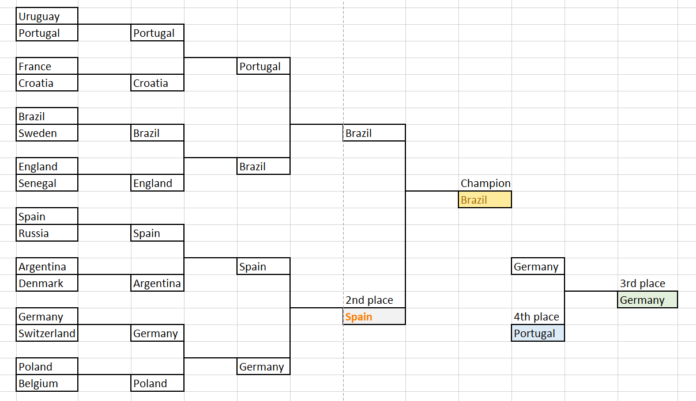
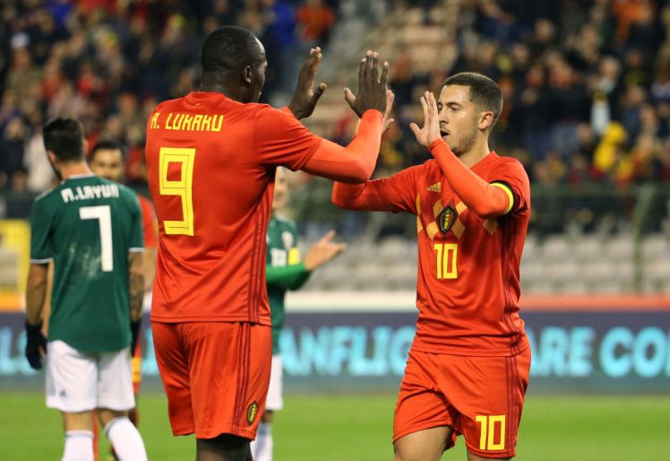

 See [GitHub Repo](https://github.com/gudgud96/FIFA-2018-Match-Predictor). 

My predictions? Belgium will be the champion. 

But it seems like a lot of my friends, **including both my linear regressor and neural network model**, favours Brazil.

I am in the midst of self-learning machine learning models for the summer holidays, and FIFA World Cup is right under our foot now! So I am thinking: why not do a small hands-on project on predicting the world cup results using ML models?

And my 3-day-long journey for the prediction task begins!

## **Day 1: Playing with datasets**

The dataset that actually sparked my interest on starting up this project is actually this [Kaggle's dataset](https://www.kaggle.com/abecklas/fifa-world-cup) (well, it just appeared in my email if you subscribed to Kaggle). This dataset contains all matches, players and titles won for FIFA World Cup since 1930. I even got inspired to build a model with an attribute on which player is playing for the match, since the players contribute significantly to the victory of the game, and we have access to this piece of information in this dataset. 

But in the end, I personally feel that this dataset is too messy and it was packed with too much unnecessary data. Then I came across [this dataset](https://www.kaggle.com/martj42/international-football-results-from-1872-to-2017/data) which has information on all international football matches. It was referred in [this Medium article](https://blog.goodaudience.com/predicting-fifa-world-cup-2018-using-machine-learning-dc07ad8dd576) that also talks about ML result predictions, though, the model in the article used a logistic regressor. I personally prefer this dataset, because:

- it has only 1 csv sheet (haha!)
- we should be looking at not only World Cup matches, but also other international matches when we make predictions
- by using data on all international matches, we should have a bigger training data size that should, by right, improve our prediction performance

Basically, the dataset contains the *year* and the *date* of a match, *name of two teams*, *both teams' scoring*, *tournament type*, *city*, *country*, and *neutrality* of the match (whether the match is held in either one team's own location). So I would say this dataset is relatively cleaner, concise, and straight-to-the-point.

## **Setting up attributes, and data preprocessing**

One big lesson that I learnt from this part is that *data would always be messy and dirty*. I come out with an analogy that compares data science to *cooking* -- first things first, data is like your meat and vegetables. **Pick the ones that are fresh, clean, and suits you the most.**

And just like a chef that doesn't really need to use cool techniques to smoke-grill or liquid nitrogen his food, as his main goal is to serve good food to his eaters even using simple ways. It is similar for a data scientist -- we don't really need to build a very fancy, complicated ML model (unless required for complicated tasks), but the main aim is to be able to tell things from the data you picked. 

The key is ***how you tell things*** - in this case, which ***attributes*** are you choosing.

So these are the attributes that I come up with, which are pretty basic and easy-to-understand:

- **Ranking of the team**

During prediction, we should take the ranking of the team in the year the match is held. If data is not available, my way to deal with it is to put a large number (I used 200, since there are less than 200 teams) as the rank.

- **Winning counts and drawing counts** 

The *mean* of winning and drawing matches of a team in all her international appearances. Losing counts are not needed since it is just the complement of the two.

- **Goal difference of a team**

The *goal difference mean* of a team in all her international appearances. eg. if team A and team B played a match with score 5-0, then the goal difference for team A is 5, and for team B is -5. This measures not just winning, but *to what extend* the team can win a game.

- **Winning counts and drawing counts against the opponent**

Basically the match history for the two teams in the match. Note that we should beware of the date of the match, and only take the match history data *in the past* into account.

- **Neutrality**

To see if one team is playing in its own country.

This is also a chance for me to practise on [pandas](https://pandas.pydata.org/), a very convenient library on data manipulation. So the first script I write is [fifa-results-preprocess.py](https://github.com/gudgud96/FIFA-2018-Match-Predictor/blob/master/fifa-results-preprocess.py), mainly to generate the attributes that I want from raw data in *results.csv*. 

One thing to share is that - the script runs for around *18 minutes*! The reason is that for each row of match data, we have to compute the match history for the two teams. For that computation, we need to traverse *all rows before that particular row* since our data is arranged in chronological order. This obviously takes O(n^2).

The pre-process generates *results_processed.csv*, which I drop some columns manually to get *results_processed_dev.csv*.

## **Day 2: Machine Learning Day**

With your garlic and onions chopped, and your beef sliced, you are ready to cook your dish chef!

So basically, this prediction task can be framed as a *classification task*. Given the attributes, we are classifying if the home team shall lose (class 0), win (class 1), or draw (class 2).

I first tried feeding my data into several types of classifiers using my script [fifa-ml.py](https://github.com/gudgud96/FIFA-2018-Match-Predictor/blob/master/fifa-ml.py). And shockingly, all classifiers return both training and testing accuracies at around **55%**, and no single classifier outperforms the other.

So, I rather use a linear regressor in the end, since it makes not much difference. The linear regressor can be thought as a 1-layer neural network, taking in *n* features and eventually returning the probability for each logits. In this case, it returns the winning, losing and drawing probability for the home team in the match. You can also use a logistic regressor, just that in my opinion in this particular task, both does the same thing.

Beware that for linear regressor, all Y examples need to be one-hot-encoded. In sklearn, I do it by using a [LabelBinarizer](http://scikit-learn.org/stable/modules/generated/sklearn.preprocessing.LabelBinarizer.html); in Keras, I do it by [to_categorical()](https://keras.io/utils/#to_categorical).

And I did it! I attached the predictions for the knockout rounds here:

So the top 4 teams are: Brazil, Spain, Argentina, Germany.

For full results (including group stage results and probabilities), check it out here: [results_predict_output_final.csv](https://github.com/gudgud96/FIFA-2018-Match-Predictor/blob/master/results_predict_output_final.csv).

## **Day 3: Neural Network Day**

Then I am wondering: since classic classifiers can't do a good job, will neural networks perform better? And so I came up with a neural network script using Keras: [fifa-ml-nn.py](https://github.com/gudgud96/FIFA-2018-Match-Predictor/blob/master/fifa-ml-nn.py).

And **the answer is no**.

Even for large networks with a lot of hidden units, it seems like the accuracy just slowly converges to, similarly, around 55% (sometimes slightly higher, and NN is my only model that hits test accuracy of 59%, which is highest for now). But I am having dense layers with 300, 500, and even 1024 units but to only spike up the performance by less than 5%. It is not worth it.

Still, there are slight difference between NN's prediction and LR's prediction. Let me attach the knockout stage predictions by NN here:

So the top 4 teams this time are: Brazil, Spain, Germany, Portugal.

For full results (including group stage results and probabilities), check it out here: [results_predict_output_nn_final.csv](https://github.com/gudgud96/FIFA-2018-Match-Predictor/blob/master/results_predict_output_nn_final.csv).

## **Conclusions and Findings**

This is quite a good introductory data science mini-project, I would say, to go through the whole process on data un-wrangling, coming up with classification attributes, and implementing a classification model.

My conclusion will be that ***football matches stays unpredictable***, and I totally agree with [this LinkedIn post](https://www.linkedin.com/feed/update/urn:li:activity:6417784109510254592/) when I read about it. The post even attached [this paper](https://arxiv.org/pdf/1806.03208.pdf) for prediction using random forest and incorporating large number of attributes, but still unable to make accurate prediction.

Not everything can be predicted using ML. It has its limitations.

For my model, I can only say that teams like Brazil, Spain and Germany are *in favour of the attributes that I have set*, which mainly takes in account of the winning statistics of a team. But we all know that winning history can't really tell much - after all, when I am writing this blog post, Germany had been eliminated by the mighty South Korea with a 2-0.

All in all, predictions are not the main priority here. The most important thing is to learn skills in handling data, telling stories from it, and last but not least...**support Belgium to the max!**

