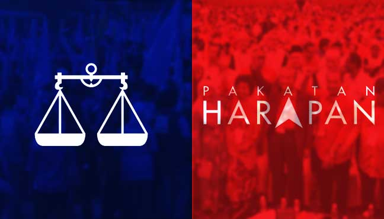
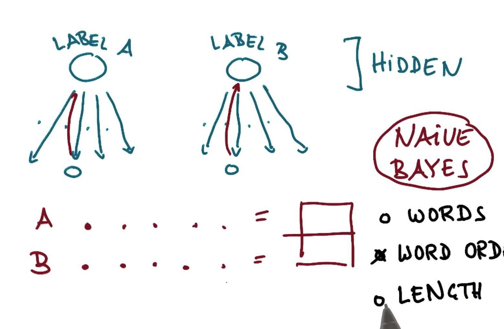
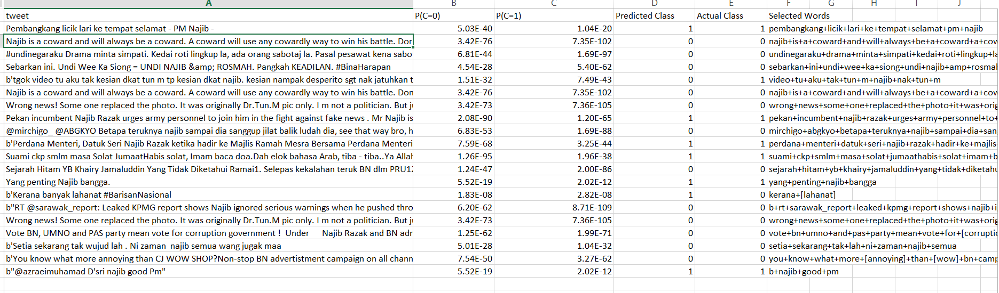
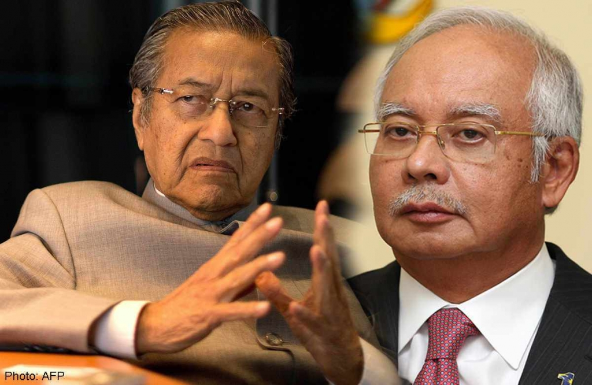

<center> See [GitHub Repo](https://github.com/gudgud96/polarity-prediction-msia-ge14/). </center>

I thought of this mini-project when I first learnt about Naive Bayes classifier on Udacity. There are tonnes of tutorials online on NB, but I just don't know why they are mainly doing spam email classification (like, 9 out of 10 of the blogs are writing about NB spam filtering). 

And at that time, my home country Malaysia was welcoming her most important election in the history, so I came up with this idea and say - why not we do a tweet analysis prior to the election, using NB as a polarity predictor?



NB is a well-known algorithm in text classification and sentiment analysis due to its simplicity, but the biggest drawback is for NB in NLP context, it is only interested the occurrence of the words, whilst neglecting the correlation between the words (hence the name "naive"). So by using NB, we could only be looking at our context in a "bag-of-words" point of view, considering *occurrence* over *correlation*.

## **What is NB doing?**

In simple words, I would like to explain NB as a "forward-backward" process.

1. The "forward" process - **given this sentence is in class *C<sub>1</sub>*, what is the number of occurrence of a word *w<sub>1</sub>*?**

2. The "backward" process - **given a word *w<sub>1</sub>* is contained in the sentence, what is the probability that this sentence is in class *C<sub>1</sub>*?**



This is why occurrence matters in NB - the more the occurrence of a word for a certain class, the greater its influence when we are doing the prediction.

The NB tutorial in [this course](https://www.udacity.com/course/intro-to-machine-learning--ud120) of Udacity's gives a short, concise, yet clear cut explanation on NB.

## **Gathering tweets**

Firstly, we need to prepare our raw material -- scrape tweets on our own in this case. So I have a [twitter_scraper.py](https://github.com/gudgud96/polarity-prediction-msia-ge14/blob/master/twitter_scraper.py) script for tweet scraping.

I use [tweepy](http://www.tweepy.org/) for the scraping part, so an API key is needed for authorization and setup. In this project, I simply scrape for tweets related to my dearest Prime Minister (oops, sorry, ex-PM now), so the polarity analysis is mainly on our dear ex-PM.

``` 
api = tweepy.API(auth)
public_tweets = api.search("najib", count=100, since="2018-04-15", tweet_mode="extended")
```

You will also need a listener to listen to the stream of tweets scraped and decide how you want to handle them. In my case, I get the tweet and pass it to [TextBlob](http://textblob.readthedocs.io/en/dev/) for polarity and subjectivity scoring, and write that out to a .csv file.

```
class PrintListener(tweepy.StreamListener):
  def on_data(self, data):
      with open("najib_tweets.csv", "a+") as output:
        # Decode the JSON data
        tweet = json.loads(data)
        i = 101
        # Print out the Tweet
        writer = csv.writer(output, lineterminator='\n')
        res = [str(i), tweet['created_at'], tweet['text'].encode('ascii', 'ignore')]
        analysis = TextBlob(tweet['text'])
        res.append(analysis.sentiment.polarity)
        res.append(analysis.sentiment.subjectivity)
        writer.writerow(res)
        uprint(tweet['text'])
  def on_error(self, status):
      print(status)
```

Lastly, attach your listener to the stream and leave it there to scrape the tweets for you! 

```
listener = PrintListener()
stream = tweepy.Stream(auth, listener)
stream.filter(track=['najib'], async=True)
```

Simply halt the process once you have collect enough tweets (in my case I collected only 300 tweets, haha).

Lesson learnt: The tweets are mainly in Malay, and the polarity scoring just do BADLY. So in the end I decided to manually annotate the class of each tweet myself on the training and testing data -- and that's why I only scrape 300 tweets.

## **Building the NB model**

I constructed a few things before moving on to the testing part:

1. Dictionary -- all words that occur in the scraped tweets. I simply use TextBlob to tokenize each tweet that I have and gather all of them.

2. Frequency table -- to count the occurrence of each word, *w<sub>i</sub>* in a given class. Dividing the number of occurrence in each class by the total number of occurrence of word *w<sub>i</sub>*, we get the **prior probability** -- given a word, the probability of it occurring in a certain class. Or, P(C|w<sub>i</sub>).

We do a pre-calculation in the dataset and we know that:
> P(C=0) = 182/300 = 0.6067

> P(C=1) = 118/300 = 0.3933

For each word in a tweet, retrieve its frequency from the table and append the prior probabilities, of each word in each class, in a list:

```
index = word_list.index(word)
f0, f1, f = float(f0_list[index]), float(f1_list[index]), float(f_list[index])
temp_p0.append(f0 / 182)  # P(word|C=0)
temp_p1.append(f1 / 118)  # P(word|C=1)
```

Take the product of all the prior probabilities (numpy does a good job here by the prod() method). You get 2 probabilities, *p<sub>0</sub>* and *p<sub>1</sub>*. 

Multiply *p<sub>k</sub>* with P(C=k) and you get the **posterior probabilities**. Compare them and the higher probability determines the class of the tweet.

```
p0 = 0 if not temp_p0 else np.prod(temp_p0)
p1 = 0 if not temp_p1 else np.prod(temp_p1)
p0_list.append(p0 * 0.6067)
p1_list.append(p1 * 0.3933)
p_class = 0 if p0 * 0.6067 > p1 * 0.3933 else 1
```

Repeat this process for each tweet, and you are able to predict the polarity of the tweet using the NB classifier!

## Findings



I isolated 20 tweets as the test set, and the NB classifier achieved **90% accuracy** (18/20 correct). 

Let's see which 2 tweets did the classifier make a mistake.

> tgok video tu aku tak kesian dkat tun m tp kesian dkat najib. kesian nampak desperito sgt nak jatuhkan tun m.

*Meaning: Watching at the video, I am not pity of Tun Mahathir but I am pity of Najib, seeing him being so desperate to take down Tun Mahathir.*



For us who understand the context, this tweet is quite obvious to belong to class 0, the anti-Najib class, but our classifier does the opposite.

Let's see which words decide the class of this tweet in the classifier:

> video + tu + aku + tak + tun + m + najib + nak + tun + m

Apparently, the term "Tun M" should be grouped together and not separated, as separating it may convey different results. Also, the most important word in the tweet for decision should be "kesian" (pity), which we do not see this in the decisioning words.

For the other tweet that we fail:

> Kerana banyak lahanat #BarisanNasional

For us, this should belong to the pro-Najib class due to the hashtag of Barisan Nasional, Najib's political party. However, hashtags are being sanitized in our implementation, so another lesson to learn here on selecting which contents to be sanitized and which not to.

The word "lahanat" (a rude word for damnation) is the main reason why our classifier groups this to the anti-Najib class. However, I shall conclude that this tweet is hard to classify as we have only 2 meaningful words, one representing each class, and we don't have any additional information.

## Conclusion

Overall, I should say that the NB classifier still did a fairly good job, provided that we have only 300 training tweets that are manually annotated. 

Of course there is a lot of room for improvement -- the first will be to **increase the size of training set**, but I can't think of any other ways available in the field to automate the annotation process for now.

It is quite shocking to see that the majority of the tweets are being anti-Najib prior to the election. We have always think undoubtedly that the Malay community will still be supportive to Najib and Barisan Nasional, but it turns out that the Malay netizens on Twitter tell us a different story.

I would say that this is a fun and easy mini-project for me to work and learn, and it is very relevant to me and my home country. Also, writing this post help to clarify the concepts of NB I have learnt, and force me to convey them in simple words. So, let's hope for more to come!