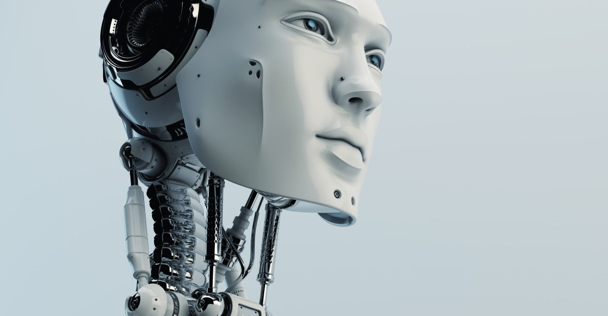
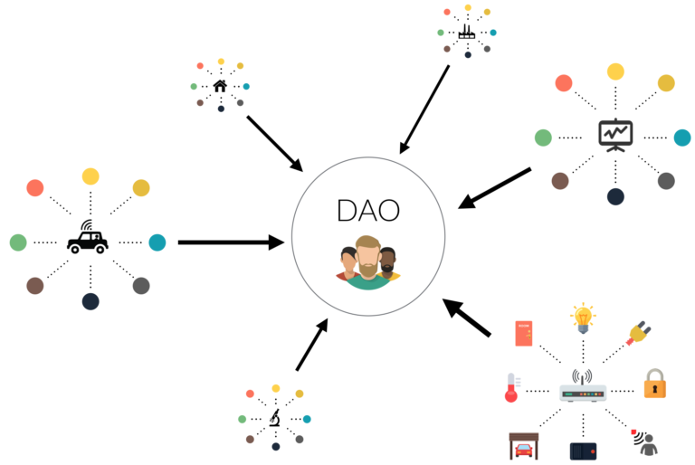
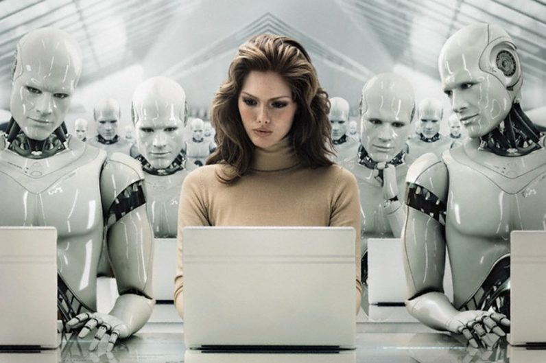

 See this [Medium article](https://medium.com/@trentmc0/nature-2-0-27bdf8238071). 

Do you believe that, blockchain could be a new life form?

Practitioners believe that we are far away from creating life using AI, as today AI is mainly developed to fulfill requirements on **efficiency** for specific task -- accuracy, speed, size, etc. Although Artificial General Intelligence (AGI) has created massive hype recently, but in real world applications we still demand AI to provide us a better recognition system, more than hoping it could give us a life-like agent.

However, I have recently read a mind-blowing [article](https://medium.com/@trentmc0/nature-2-0-27bdf8238071) written by Trent McConaughy on Medium, which let me rethink about how we should frame the concept of "life" in the context of AI.

## **Life as a "self-sustaining entity"**

Trent's "life" doesn't take into account of cognition, conscienceness and so on. For Trent, **"life" here simply refers to a** ***"self-sustaining entity"***. 

The "life" entity has 2 properties to fulfill:

1. ***Self-sustaining*** -- feed on its own, able to sustain oneself with some kind of "incentive". For animals that could be food, for us that could be money or etc.

2. ***Anti-fragile*** -- it could not be easily destroyed; instead, it gets stronger after being attacked. eg. Think of human, either as an entity or a community. Trent also gives an example on forests, when burnt by fire trees will grow higher and stronger.

How could this kind of "lifeform" be achieved in AI?

For that, we should include the concept of blockchain, framing it in the point of view of ***"decentralized autonomous organization" (DAO)***.

##### (Duh, I first thought DAO refers to Data Access Object -- apparently it isn't.)

We know that the concept of blockchain backs the Bitcoin community. Personally, I conclude that the blockchain concept contributes these 2 main ideas to DAO:

1. ***Incentive machine*** -- the whole system incentivizes "an effort" by rewarding one with "an incentive". In the Bitcoin context the "effort" is security, as miners spend computational power to solve a hard cryptographic problem; whereas the "incentive", is Bitcoin.

2. ***Decentralization*** -- no single node can control the whole system, as the current state is a consensus reached by the majority of nodes in the network. Hence when the system is initiated, it can't be stopped practically, as there is no "on-off" button held on by someone.

It is precisely these 2 ideas that build the DAO --

- ***decentralized***, well, as stated above;

- ***autonomous***, because it is incentivized such that it will work voluntarily and automatically;

- and it comes with ***resource manipulation***, as it can own, trade or do whatever with its earned "incentives"!

Now we can understand Ralph Merkle's unfathomable quote, saying that blockchain is a new life form:

> …It lives and breathes on the internet. It lives because it can pay people to keep it alive. It lives because it performs a useful service that people will pay it to perform. It lives because anyone, anywhere, can run a copy of its code. It lives because all the running copies are constantly talking to each other. It lives because if any one copy is corrupted it is discarded, quickly and without any fuss or muss. It lives because it is radically transparent: anyone can see its code and see exactly what it does.

It is precisely that --

- DAO is *"self-sustaining"* due to its autonomy, backed by the concept of incentive machine;

- and it is *"anti-fragile"* due to decentralization, as it cannot be destroyed easily by an "on-off" button, and a single attack could have make the whole network stronger.

Believe it or not, DAO is the new building block of "life form"!

## **And AI comes in with DAO...**

When AI comes together with DAO, ***it simply makes the DAO perform better at its incentivized work.***

I particularly like the idea of Trent on ArtDAO: 

> The agent generates art **(work)** -> sells it on a marketplace **(community interaction)** -> earns token **(incentive)** -> generates art again -> ...

The cycle of "work, community interaction, incentive" is precisely how human operates today, and it is a sustainable way to operate!

So in some day, self-driving cars can work to fetch people to some places and earn by its own.

AI music composers can compose music, publishes it and earn royalties by its own.

Even Google Translate can do translation and earn money by its own!

In short, ***AI gives DAO greater capabilities, and DAO gives AI the form of life sustainability.***

It is ultimately unstoppable!

## **If we all employ AI DAO agents...**

Trent gives this whole concept a fancy name called "Nature 2.0", portraying an ecosystem built on silicon and steel.

I personally think that this idea is indeed revolutionary and mind-blowing. But I prefer using the term ***"autonomous agent"*** over ***"life"***. To me, life should be a far more complex entity filled with emotion and conscienceness, compared to a purpose-oriented autonomous agent. Even till one day when a self-driving car could accumulate wealth by its own, we should not acknowledge that as "life". 

But, issues like the legal position of these types of autonomous agents, and whether to grant legal rights to them, would be a different topic and need further discussion.

However, Trent's view does provide an insight on how we could elevate autonomous agents to the next level -- how they could be truly "autonomous" and "self-sustaining". 

There are two types of world views from here, representing two types of mindsets.

The first one: AI DAOs will be our ***competitors*** -- if we are in the same "marketplace" as these agents, they could be snatching away our job opportunities *forever*, thanks to evolving AI technology and DAO making it self-sustaining.

But I prefer a second worldview:

### ***Let these agents do the work!*** 

Humans employ these agents, train them to be good workers, and make them work for us!

Imagine this: one day every person owns a company, with a number of AI DAO agents as his worker. Each of them work for different aspects -- some as autonomous accountants, some as structural engineers, some as graphic designers...

And all these agents are managed by an AI DAO manager, programmed for decision-making in resource allocation, profit optimization, etc. This entire community will be an "automated sustainable company" for us.

### ***They work, and they earn, and they generate revenue for us!***

When that day comes, every human being are "freed" from working for money. All of us are capable of being an entrepreneur, building a sustainable company, having a team of AI DAO agents generating revenue for us. They realize your passion and dreams, you earn passive income, achieve financial freedom, do even more passionate stuffs... 

Wow, I should say, let's hope for that day to come!