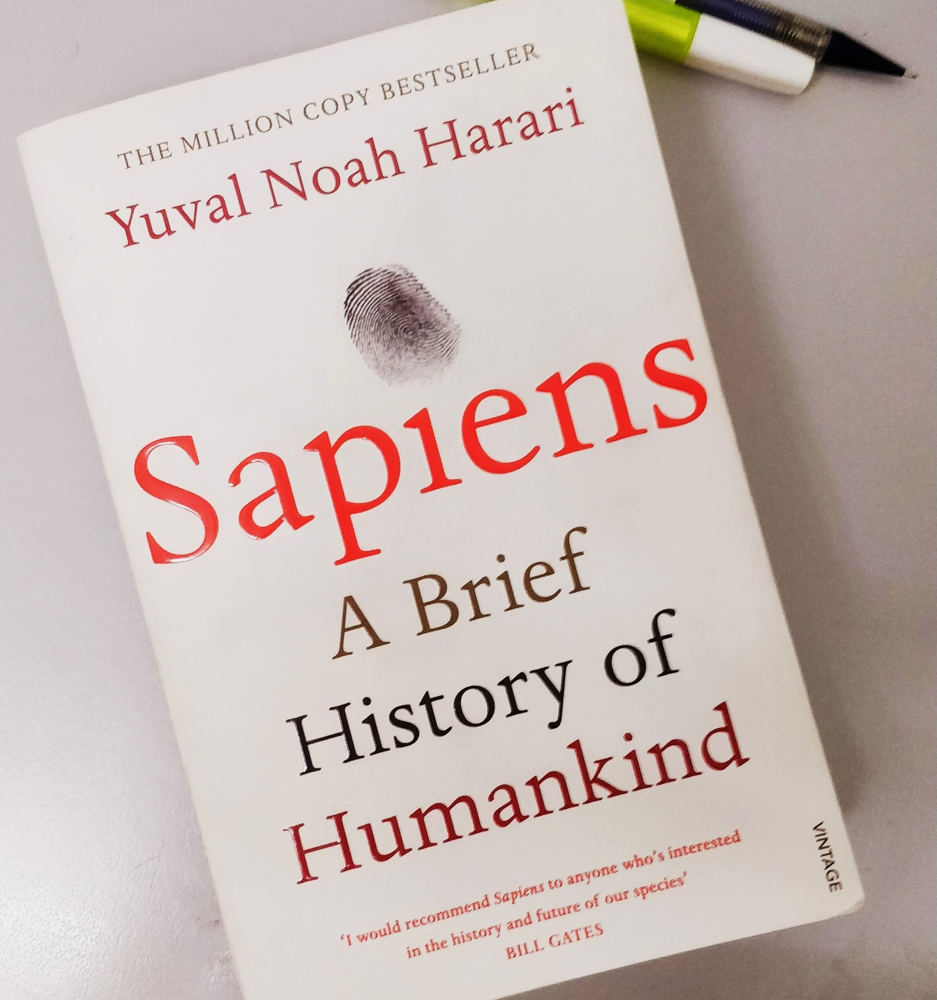
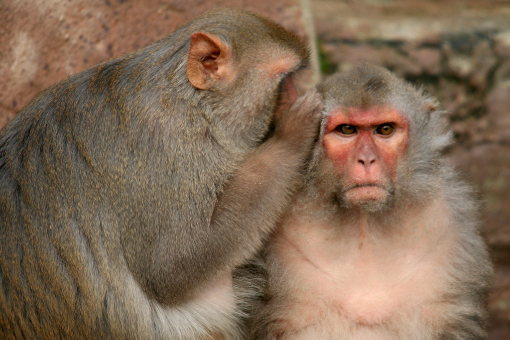
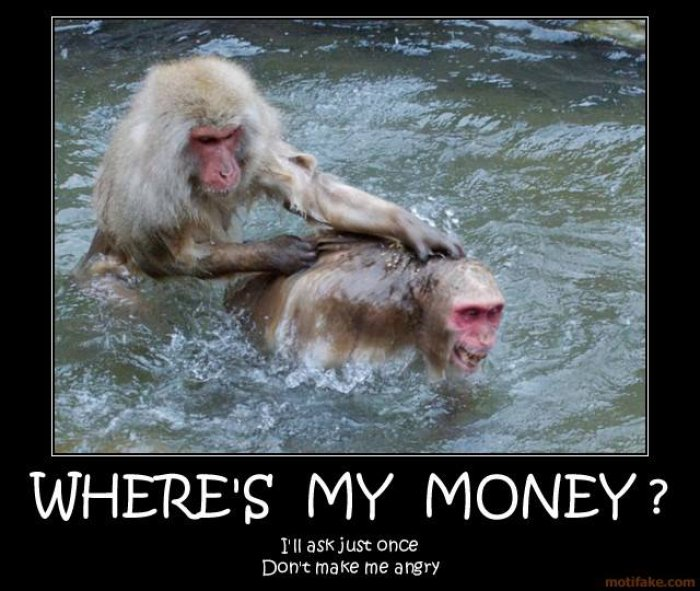
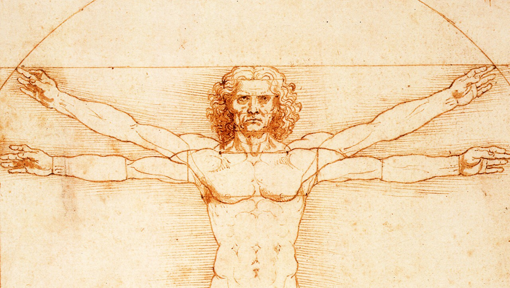
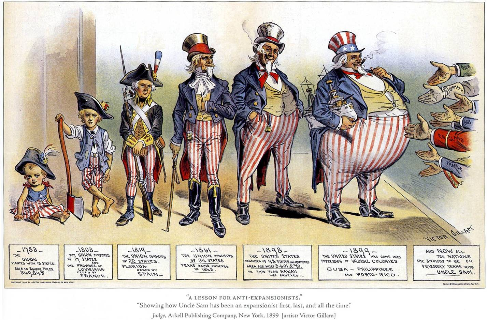
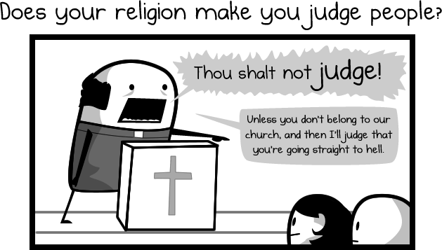

 See this [book review](https://books.google.com.my/books/about/Sapiens.html?id=FmyBAwAAQBAJ&source=kp_cover&redir_esc=y) to know more about Sapiens. 

How have we come over as human beings, or should we call ourselves *homo sapiens*, after such a long time in history?

I have just finished reading Yuval Noah Harari's ***Sapiens: A Brief History of Humankind***, and I was totally mind-blown-ed! I would say that anyone who has read this book will definitely be amazed by the unique perspective provided by Yuval to peek into the constant flux of humankind's history.

I will cover 10 key points that I find interesting in this book, and this article serves as the first part which will cover 5 of them, focusing on the topic on **"how have we come over as human beings"**.

## **1. Cognitive revolution - it all starts from gossiping**

Sapiens seem to have a revolution in their cognitive abilities around 70 thousand years ago, starting to drive the Neanderthals away from Earth, and started to invent boats to cross the sea and many other tools like lamps, arrows and needles. 

But this "cognitive revolution" doesn't seem to be a genetic mutation in Sapien's head, rather, it seems to be an evolution in Sapiens' *language* -- Sapiens are able to communicate effectively about **abstract concepts** using language.

And scholars speculate 2 theories on how the language system evolve - both have interesting names.

One is called the ***"there is a lion near the river" theory***. When a Sapien senses danger, like spotting a lion near the river, there is a need for him to spread the news to his fellow Sapiens as well. And how he signals them is probably by producing some distinct sound to send the message that "Careful, there is a lion!", and those distinct sounds slowly evolve to become a language system.

Another one is called the ***gossiping theory***. Probably in the very ancient Sapiens history, when our ancestor monkeys have nothing to do after hunting for food, they hang around the trees chattering about the prettiest monkey in their group, or trying to talk about which monkey is the other tree is having an affair with our monkeys, but again, using random noises at first. And slowly, it evolves and become a language system.

It sounds interesting to me at first, but after all it may explain why human beings just love gossiping about others. **Gossiping may be an in-built nature of Sapiens, and to serve this nature, language was borned.** 

So, Sapiens achieved all these not because of some kind genetic mutation in their genes for all a sudden. They could achieve these because there is an efficient way of communication which allows them to talk about not just concrete objects, but also **abstract concepts**. One Neanderthal may be better than one Sapien, physically and mentally. But with the ability to convey abstract concepts, Sapiens can be united by believing in common myths, talk about tactics, cooperate and win the battle and wipe off Neanderthals to survive till today.

## **2. Intersubjectivity, myth and imagined order**

Concepts can be categorized into 3 groups: ***objective***, ***subjective*** and ***inter-subjective***.

Objective concepts are **facts**. They are indisputable, like a triangle has three sides, the sun comes up from the east, and so on.

Subjective concepts are **opinions**. They are arguable and debatable, like if Charlie Puth's music is better or Celine Dion's.

Inter-subjective concepts are **common beliefs**, or sometimes known as ***myths***. Their existence can't be proved, they are often abstract, but they are concepts that the community, altogether, believe in its truth.

One example is money. "Money" itself doesn't exist, nor coins are money - as they are merely some round-shaped metallic objects. Only when we believe together that these round-shaped metallic objects behold some value that allow us to trade for other stuffs, that these coins could be called and functioned as "money".

So, the vast number of Sapiens can cooperate together only with the common belief in some kind of myth, and this is known as the ***imagined order***. In the old days, the imagined order could be to please the River God or the Gods in Pantheon; today it could be the social contract, freedom of speech and equal rights. In either ways, it is the essential element that glues us together, and yet tears us apart at the same time.

## **3. Agriculture revolution - a luxury trap**

Up till a point of time in history, Sapiens became so resourceful that they stopped hunting. That was 10 thousand years ago when they started to manipulate the lives of just a few species of animals and plants - by **domesticating** them, as they believe this would provide them with more food and resources.

We have always believed that agriculture revolution is a leap in progress in humankind's history. But it seems like *"the extra food did not translate into a better diet or more leisure"*. Yes we have more food, but only of a narrow spectrum of nutrients. And we have to put in more effort on watering the plants, removing the weeds under the hot sun. We built systems to ease us in farming the crops, and our lifestyle changed according to how the crops grow.

Wait a second, ***are we breeding the plants, or are they breeding us?***

Yuval called this a **luxury trap**. And according to him luxuries tend to become necessities and to spawn new obligations, which seems pretty reasonable in the context of agriculture -- when we have more food, we have a larger population, and we need more food, and we have an even larger population. With this we came up with all kinds of legislations to stipulate on how much food is aggregated, how many people should farm and work at each time, etc.

I feel a sense of déjà vu when I read about Yuval's quote as below: 

> Agricultural revolution is history's biggest fraud.

And look at today's world. ***Isn't the technological advancement today is a luxury trap by itself?*** And I have to ask: are we going to stay in the trap to wait for new obligations spawned, or should we find a way out? But even if so, how?

## **4. Humanism - liberal, socialist, evolutionary**

This is a very clear and concise framing of the concept of *humanism* in this book throughout the history. There are mainly three types of humanism:

1. ***Liberal humanism***: Humanity is **individualistic**. In simple words, you are free to do whatever you like, and this sense of freedom should be default to a human being. Hence the utmost important task in liberal humanism is to protect the freedom of each Sapien, and the right to pursue freedom. One example will be the idea of [natural rights](http://www.crf-usa.org/foundations-of-our-constitution/natural-rights.html) proposed by John Locke, which one of them includes right of liberty.

2. ***Socialist humanism***: Humanity is **collective**. It means that you are only human when you belong to the group of human *as a whole*. Hence **equality** becomes important because one believes that only by treating each individual equally, that we could call ourselves "humans". There are many examples when we talk about equality, like Martin Luther King, or gender equality movement, name it and you get it.

3. ***Evolutionary humanism***: Humanity is **a mutable species**. One believes this also believes that humanity is a result of natural selection, hence it can evolve into superhumans, or degenerate into subhumans. This idea gives rise to the race supremacy, claiming that one race shows a better quality of humanity in comparison to the other. One obvious example will be the Nazis and white supremacy, that sees themselves as a supreme community and bears the "white's burden" to purify the others.

## **5. Unification of mankind - money, empire and religion**

### **Money**

So, how did human beings get unified and identify ourselves as "human beings" as a whole?

Well first, there's money. After all, if one sells you a chicken, how should you repay it back if you only know how to produce apples? When *"everyone works according to their abilities, but receives according to their needs", we need some kind of moderator, and that is money.

Moreover money is ***the most universal and efficient system of mutual trust ever established***. When we all see a 1 dollar bank note, we all agree that it beholds the value of "1 dollar". I believe it, because others believe it, and they believe it because I believe it. With this common belief, we have the first ever value system which is agreed by all, and is able to value every single object that we encounter. 

Such universality contributes to our unification, and give rises to today's **economics**.

### **Imperialism**

Then, there is imperialism. Our first instinct on imperialism and empires may be negative, as it often symbolizes cruelty, brutality and blood-spilling wars, but we have to admit that imperialism unified the culture of different tribes and built a bigger nation. Examples are ubiquitous, ranging from the Roman Empire, the Chinese Empire by *Qin Shi Huang*, or the British colonization. 

These imperial cycles exported the same set of culture to their subjects for ease of control. They unified the political framework and the social structure, which stipulated that all people under the colonization should speak in the same language, behave in the same manner, and believe in the same myth.

And this, gives rise to today's **politics**.

### **Religion**

One more thing would be religion. Our ancestors do not have the weapon of knowledge to explain a lot of their encounters - like, why crops don't grow as they should be? Why is there wind, rain and storm?

To solve these unexplainable questions, we come up with an answer: there is a ***superhuman order*** governing our world, and these superhumans are called Gods. So we need a River God, a Rain God, A Wind God and many more gods to explain the unexplainables, which gives rise to ***polytheism***, and in particular, ***animism*** at first.

Slowly humans develop different events and taboos to serve these gods, eg. during Agricultural Revolution, farmers provided sacrifice to the River God in exchange of good weather for cropping, and so on. Such events became so habitual among a certain community that they became religious practices that glued the community members together for several generations.

And instead of believing in multiple Gods with partial power, why not worship a God with all powers? That gives rise to ***monotheism***. Or one may believe that as a whole, the world is governed by a good God and an evil God, which then gives rise to ***dualism***.

Monotheism can't explain evil, and dualism can't explain unified order. This is known as the [Problem of Evil](https://en.wikipedia.org/wiki/Problem_of_evil), which I will talk about it in future articles.

In today's world, with a large number of existing atheist it seems like religion has slightly lost its influence. However within the religious community, we could still see how religion unified its followers of different background to believe in the same set of virtue ethics.

## **Summary**

We see how we started from a cognitive revolution, which allowed us to believe in the same myth and cooperate. Then we initiated the agricultural revolution, that left us in a luxury trap. Gradually, humankind was then unified by its 3 main pillars -- politics, economy and religion, through different forms until today.

In Part 2, we will take a look in the modern days and see **"what we are taught to believe in"**.